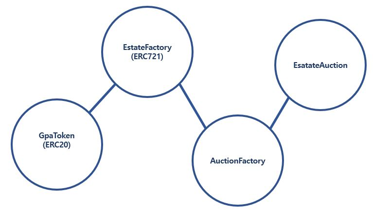
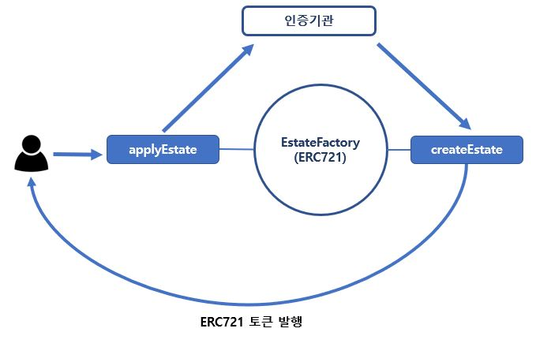
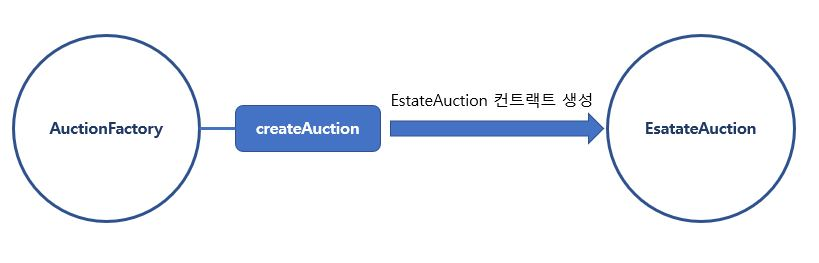
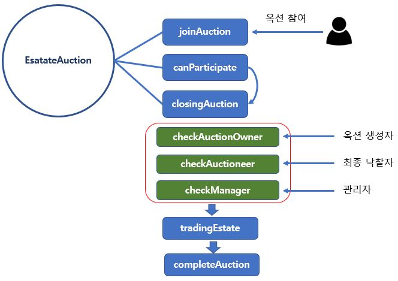
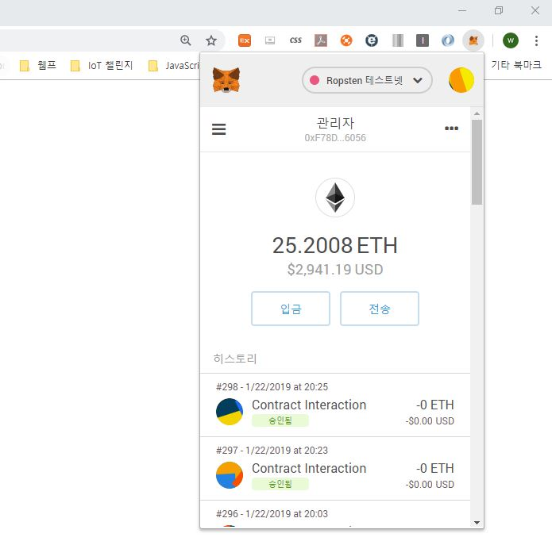
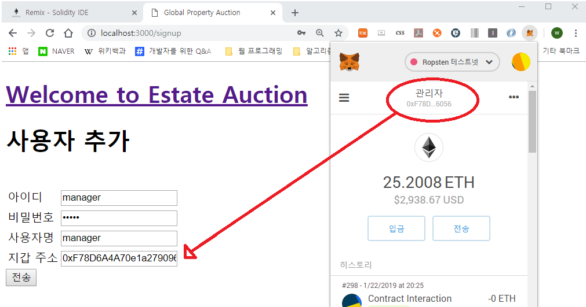

# 이더리움 기반의 부동산 옥션 사이트 #
본 프로젝트는 EIPs (Ethereum Improvement Proposals) 에서 제안된 표준 인터페이스 ERC20, ERC721을 사용하여 자바스크립트 기반의 글로벌 부동산 경매 사이트를 만들어 보는 것입니다. 해당 프로젝트는 Ropsten Network를 기준으로 개발하였습니다.

> ERC20, ERC721을 학습하는 관점에서 만든 프로젝트라 복잡.

## 개발환경 ##
- Language: solidity, JavaScript, NodeJS
- Network: Ropsten Network
- View Engine: handlebars
- DB: mongoDB
- os: windows 10

## 현재 배포된 스마트 컨트랙트 주소 ##

GPA Token Address: "0x27AE2362496588EA547bC801316F8958e08B2A28"

EstateFactory Address: "0xd73d67588d22e6d0ab9c54d508a0be9edb9d508c"

AuctionFactory Address : "0x1241d99a37c7c1c663abd2dd48de034afd70dad0"

mongod --dbpath /Users/woojo/database/local
mongo

## 스마트 컨트랙트 ##

- 이번 프로젝트를 위해 총 4개의 스마트 컨트랙트를 만들었다.

### 1. GpaToken ###
- GPA는 Global Property Auction의 약자이며 GpaToken 컨트랙트는 부동산 경매시에 사용될 토큰을 발행하기 위해 만들었다.

### 2. EstateFactory ###
- EstateFactory 스마트 컨트랙트는 ERC721 표준 인터페이스를 기준으로 만들었다. 
- 부동산 소유자가 applyEstate함수를 통해 자신이 소유한 부동산을 거래가 가능한 토큰으로 신청하면 인증기관(운영자)에서 여러 검증을 거치게 되며 createEstate함수를 통해 ERC721 표준 인터페이스 기준의 토큰으로 발행해 주게 되며, 이를 통해 부동산 거래가 가능하게 만들어 준다.    

### 3. AuctionFactory ###
- AuctionFactory 스마트 컨트랙트는 부동산 경매를 신청하기 원하는 사용자에게 경매를 진행할 수 있는 EstateAuction 스마트 컨트랙트를 만들어 준다.

### 4. EstateAuction ###
- EstateAuction 스마트 컨트랙트는 부동산 경매가 진행되는 컨트랙트이다. 
- 옥션에 참가를 희망하는 사용자는 joinAuction이라는 함수를 통해 옥션에 참여할 수 있다.
- canParticipate함수는 옥션의 마감시간이 지나지 않았는가를 확인하며, 마감시간이 다 되면 closingAuction함수를 실행시킨다.
- closingAuction함수가 실행되면 더 이상 부동산 경매에 참여할 수 없게 되며, 최종 낙찰자와 EstateAuction 생성자, 관리자가 모두 확인을 해야한다.
- 최종 낙찰자, 옥션 생성자, 관리자가 모두 확인을 하면 tradingEstate함수가 진행되며, 옥션 생성자의 ERC721로 된 부동산과 최종 낙찰자의 GPAToken이 거래된다. 

## 메타마스크를 통한 로그인 ##
#### 브라우저 Web3js 라이브러리를 통해 MetaMask와 통신하여 사용자 인증  ####

----------

## 회원가입 ##
#### 회원가입시 메타마스크의 EOA계정 등록  ####

----------

## 로그인 ##
#### 로그인 시 메타마스크의 Account와 등록한 Account가 같아야 한다. ####

----------

## MyPage ##
- MyPage에서는 내가 소유한 GpaToken을 확인 할 수 있다.
- 소유한 부동산 자산을 ERC721로 신청 할 수 있다.
- 현재 신청중인 부동산 자산을 확인 할 수 있다.
- 자신이 소유한 현재 ERC721로 된 부동산 자산을 확인 할 수 있다.
### 1) 부동산 신청하기 ###
사용자가 소유한 부동산을 거래가 가능한 ERC721 토큰 형태로 만들기 위해 인증기관에 신청한다. **EstateAuction -> applyEstate()**

### 2) 인증기관 승인 ###
- 인증기관에서 신청한 부동산 자산을 검증했다고 가정하에, **EstateAuction -> createEstate()** 를 통해 ERC721 토큰으로 발행 후 소유주에게 전달한다.
- 아래 그림에서 확인되는 것처럼 신청중인 부동산 자산이 소유하고 있는 부동산 자산으로 넘어가고 토큰id를 부여 받는다.

