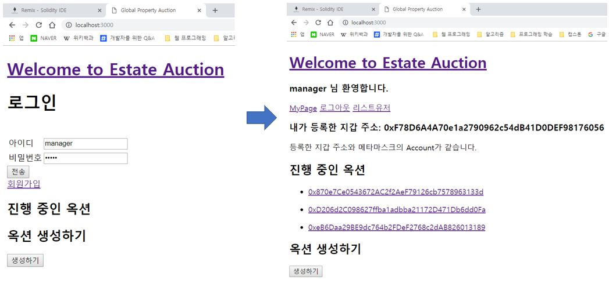
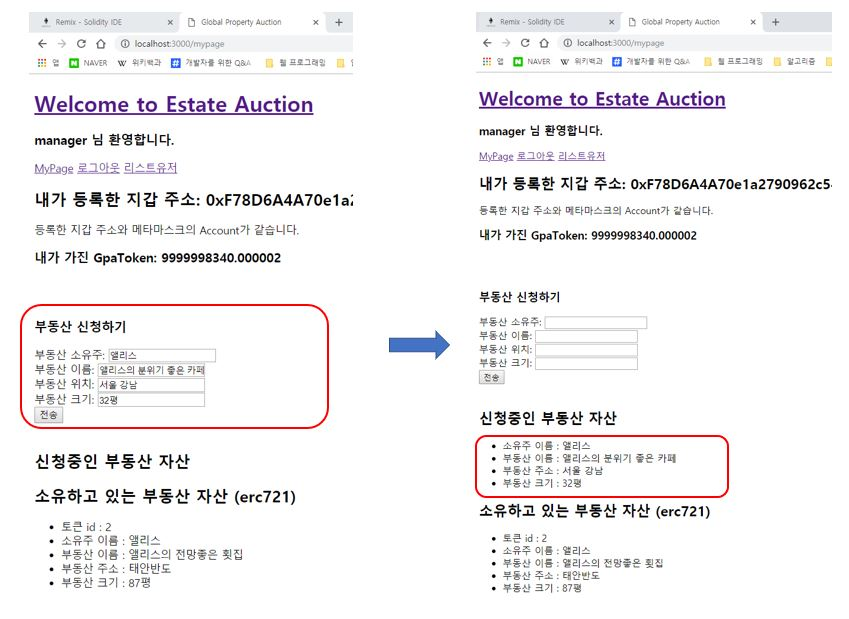
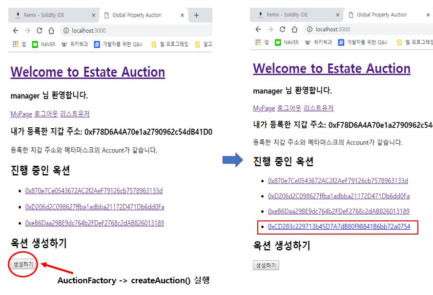
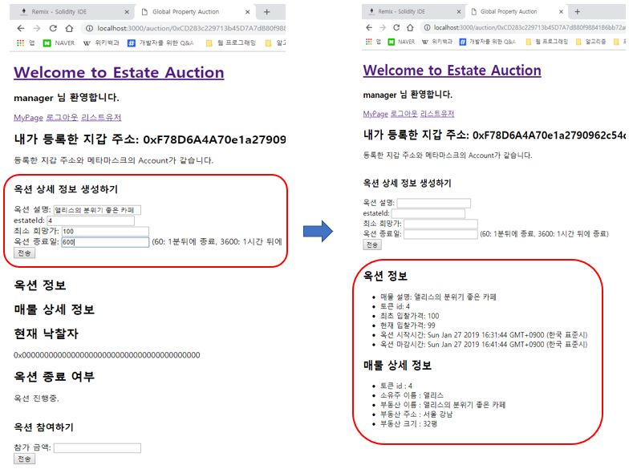
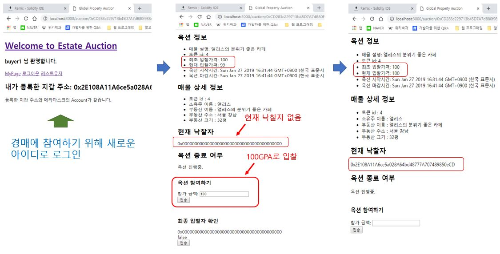
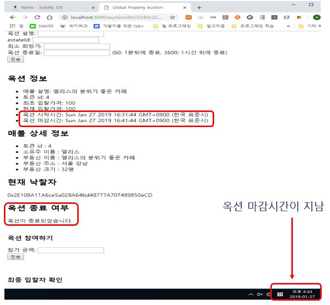
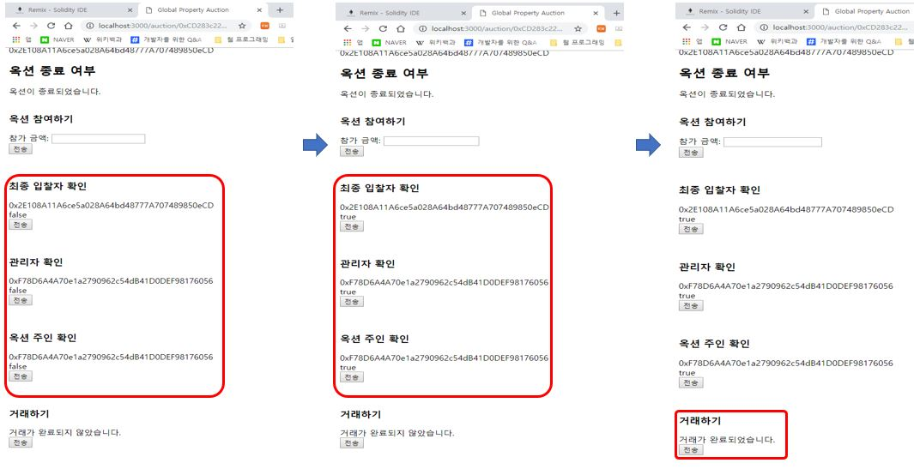
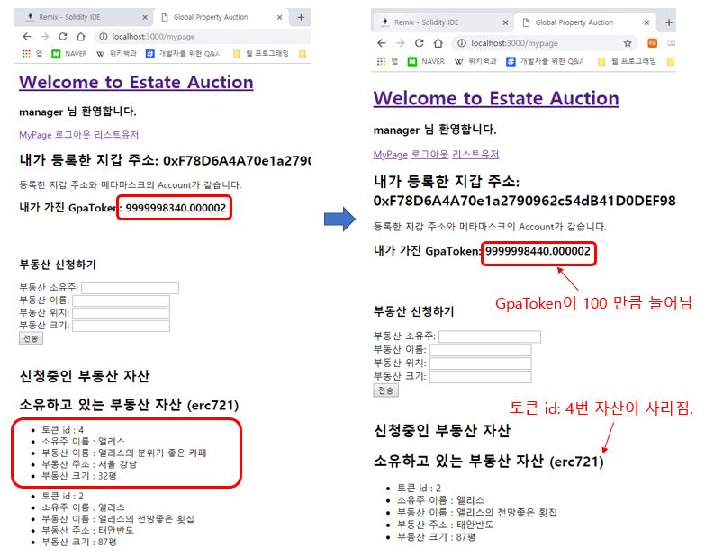
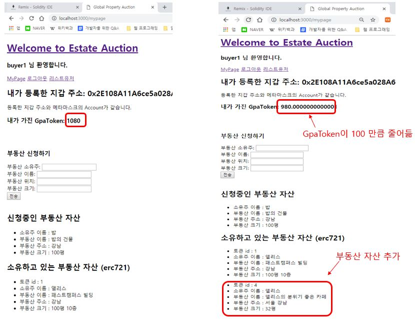

# 이더리움 기반의 부동산 옥션 사이트 #
본 프로젝트는 EIPs (Ethereum Improvement Proposals) 에서 제안된 표준 인터페이스 ERC20, ERC721을 사용하여 자바스크립트 기반의 글로벌 부동산 경매 사이트를 만들어 보는 것입니다. 해당 프로젝트는 Ropsten Network를 기준으로 개발하였습니다.

> ERC20, ERC721을 학습하는 관점에서 만든 프로젝트. MVC패턴으로 구현하려고 했는데 시간이 부족하여 브라우저에서 바로 실행하도록 구현해 놨음. 추후 MVC 패턴으로 할 예정.

## 개발환경 ##
- Language: solidity, JavaScript, NodeJS
- Network: Ropsten Network
- View Engine: handlebars
- DB: mongoDB
- os: windows 10

## 현재 Ropsten Network 배포된 스마트 컨트랙트 주소 ##

GPA Token Address: "0x27AE2362496588EA547bC801316F8958e08B2A28"

EstateFactory Address: "0xd73d67588d22e6d0ab9c54d508a0be9edb9d508c"

AuctionFactory Address : "0x1241d99a37c7c1c663abd2dd48de034afd70dad0"

## 스마트 컨트랙트 ##

- 이번 프로젝트를 위해 총 4개의 스마트 컨트랙트를 만들었다.

### 1. GpaToken ###
- GPA는 Global Property Auction의 약자이며 GpaToken 컨트랙트는 부동산 경매시에 사용될 토큰을 발행하기 위해 만들었다.

### 2. EstateFactory ###
- EstateFactory 스마트 컨트랙트는 ERC721 표준 인터페이스를 기준으로 만들었다. 
- 부동산 소유자가 applyEstate함수를 통해 자신이 소유한 부동산을 거래가 가능한 토큰으로 신청하면 인증기관(운영자)에서 여러 검증을 거치게 되며 createEstate함수를 통해 ERC721 표준 인터페이스 기준의 토큰으로 발행해 주게 되며, 이를 통해 부동산 거래가 가능하게 만들어 준다.    

### 3. AuctionFactory ###
- AuctionFactory 스마트 컨트랙트는 부동산 경매를 신청하기 원하는 사용자에게 경매를 진행할 수 있는 EstateAuction 스마트 컨트랙트를 만들어 준다.

### 4. EstateAuction ###
- EstateAuction 스마트 컨트랙트는 부동산 경매가 진행되는 컨트랙트이다. 
- 옥션에 참가를 희망하는 사용자는 joinAuction이라는 함수를 통해 옥션에 참여할 수 있다.
- canParticipate함수는 옥션의 마감시간이 지나지 않았는가를 확인하며, 마감시간이 다 되면 closingAuction함수를 실행시킨다.
- closingAuction함수가 실행되면 더 이상 부동산 경매에 참여할 수 없게 되며, 최종 낙찰자와 EstateAuction 생성자, 관리자가 모두 확인을 해야한다.
- 최종 낙찰자, 옥션 생성자, 관리자가 모두 확인을 하면 tradingEstate함수가 진행되며, 옥션 생성자의 ERC721로 된 부동산과 최종 낙찰자의 GPAToken이 거래된다. 

## 메타마스크를 통한 로그인 ##
#### 브라우저 Web3js 라이브러리를 통해 MetaMask와 통신하여 사용자 인증  ####

----------

## 회원가입 ##
#### 회원가입시 메타마스크의 EOA계정 등록  ####

----------

## 로그인 ##
#### 로그인 시 메타마스크의 Account와 등록한 Account가 같아야 한다. ####

----------

## MyPage ##
- MyPage에서는 내가 소유한 GpaToken을 확인 할 수 있다.
- 소유한 부동산 자산을 ERC721로 신청 할 수 있다.
- 현재 신청중인 부동산 자산을 확인 할 수 있다.
- 자신이 소유한 현재 ERC721로 된 부동산 자산을 확인 할 수 있다.
### 1) 부동산 신청하기 ###
사용자가 소유한 부동산을 거래가 가능한 ERC721 토큰 형태로 만들기 위해 인증기관에 신청한다. **EstateFactory -> applyEstate()**

### 2) 인증기관 승인 ###
- 인증기관에서 신청한 부동산 자산을 검증했다고 가정하에, **EstateFactory -> createEstate()** 를 통해 ERC721 토큰으로 발행 후 소유주에게 전달한다.
- 아래 그림에서 확인되는 것처럼 신청중인 부동산 자산이 소유하고 있는 부동산 자산으로 넘어가고 토큰id를 부여 받는다.

----------
## Auction 생성 ##
### Auction 생성하기1 ###
- Main화면의 옥션 생성하기에서 생성하기 버튼을 클릭하면 **AuctionFactory->createAuction()** 이 실행되면서 경매를 진행할 수 있는 **EstateAuction** 컨트랙트가 생성된다.
- 아래  그림에서 확인되듯이 **진행 중인 옥션**에 추가된 **EstateAuction** 컨트랙트를 확인할 수 있다.

### Auction 생성하기2 ###
- 생성된 EstateAuction 주소를 클릭하여 EstateAuction을 만든 옥션 생성자는 옥션 상세 정보 생성하기를 통해 자신이 진행할 옥션을 만들수 있다. **EstateAuction -> createAcution()**

----------

## Auction 참여하기 ##
- 참가하고 싶은 옥션에 들어가 **옥션 참여하기**에서 입찰하고 싶은 **GpaToken**의 수를 적고 전송을 누른다.

## Auction 종료 ##
- **EstateAuction -> canParticipate()**함수를 통해 옥션의 마감시간이 지났는지 확인하고, 마감시간이 지나면 **EstateAuction -> closingAuction()**함수를 실행하여 옥션의 참여가 불가하도록 한다. 

----------

## 거래 완료 ##
1. 옥션이 종료되면 **옥션 생성자**, **최종 입찰자**, **관리자**의 **확인**.
2. 옥션에 등록된 옥션 생성자 소유의 **ERC721 부동산 자산**과 최종 옥션 입찰자의 **입찰된 GpaToken** 만큼 서로 교환되고 거래가 완료된다.**EstateAuction -> tradingEstate()** 

## 거래 확인 ##
### 1) 옥션 소유자의 상태변화 ###
- **소유하고 있는 GpaToken 100이 증가하였다.**
- **소유하고 있던 ERC721로 정의되었던 4번 부동산 자산이 사라졌다.**

### 2) 최종 입찰자의 상태변화 ###
- **소유하고 있는 GpaToken 100이 감소하였다.**
- **입찰하였던 ERC721로 정의되었던 4번 부동산 자산이 나의 소유로 추가되었다.**
 
